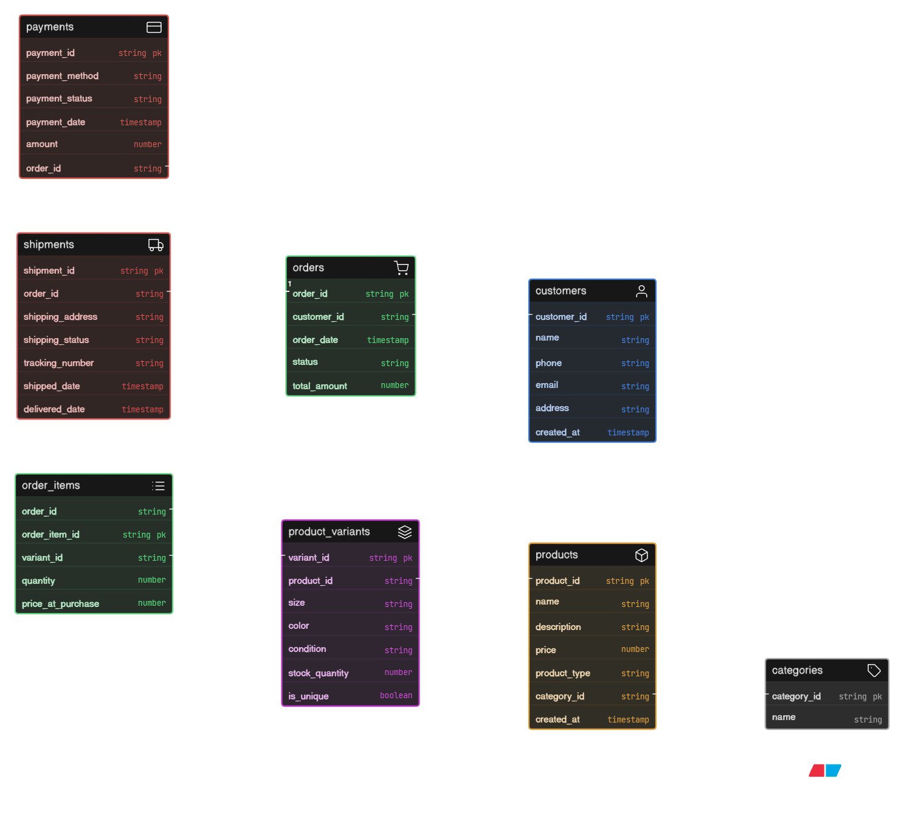

# Thrift + Handmade Store ER Diagram

## 📌 Overview

This project contains the ER diagram for a small Instagram-based business that sells:

* Thrifted (unique) products
* Handmade (multi-stock) products

The system is designed to manage:

* Products & inventory
* Customers
* Orders
* Payments
* Shipping

---

## 🧠 Key Design Decisions

* Thrift items are modeled as unique (`stock_quantity = 1`)
* Handmade items support multiple quantities
* Product variants handle size, color, and condition
* OrderItem is used as a junction table for many-to-many relation

---

## 🧱 Entities Included

* Customer
* Product
* ProductVariant
* Category
* Order
* OrderItem
* Payment
* Shipment

---

## 🔗 Relationships

* One customer can place multiple orders
* One order can contain multiple products
* One product can have multiple variants
* Orders are linked to payment and shipment

---

## 📷 ER Diagram

---

## 🚀 How to Use

This diagram can be used as a base for:

* Database implementation (SQL/NoSQL)
* Backend system design
* Scaling small e-commerce platforms

---

## 📁 Files

* `erd.png` → Final ER diagram
* `README.md` → Project explanation
